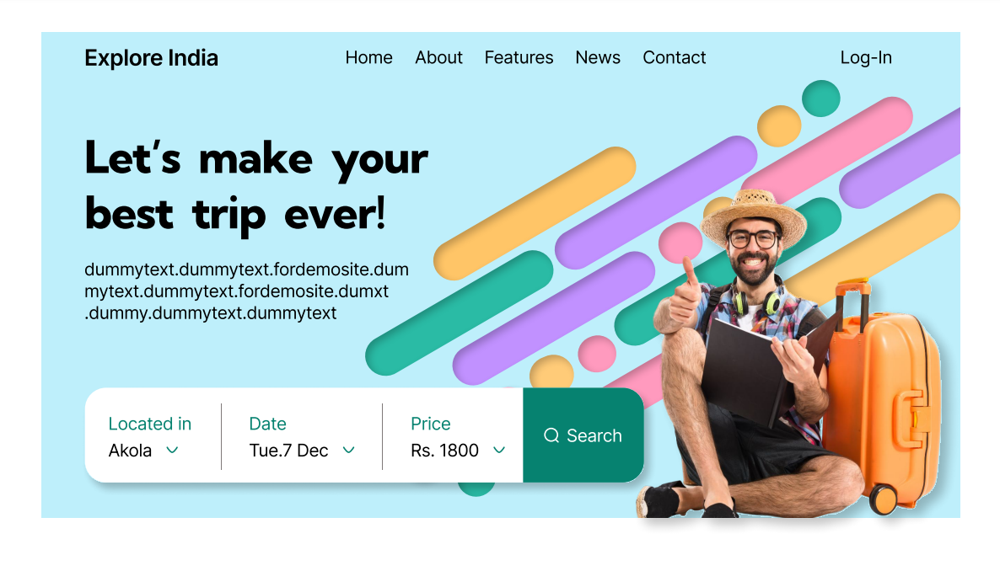
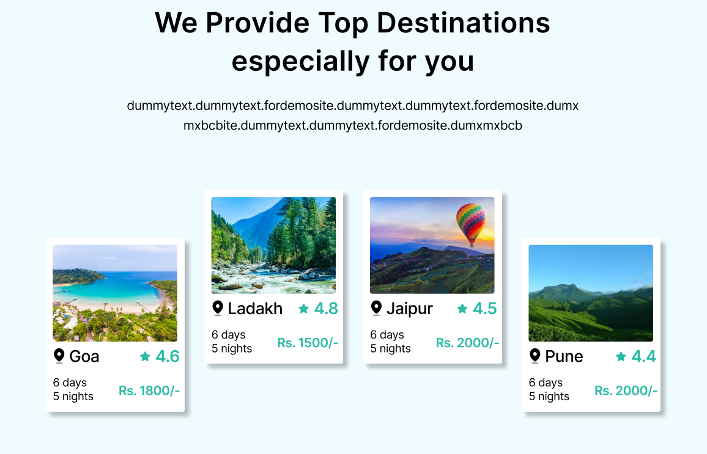

# Travel Website Design

**Overview**
This Figma file showcases the design for an innovative travel website. It includes a modern homepage, intuitive search functionality, and a user-friendly booking process.

**Design Tools**
* Figma

## Images

**Design Process**
A user-centered design approach was employed, incorporating user research and iterative design cycles. User interviews and surveys informed the design, focusing on pain points and preferences.

**Design System**
The design adheres to a consistent design system ensuring visual harmony and efficient design updates. A comprehensive component library is included, providing reusable design elements.

**Accessibility**
Accessibility was a key consideration throughout the design process. Color contrast ratios, keyboard navigation, and alternative text for images were carefully implemented.

